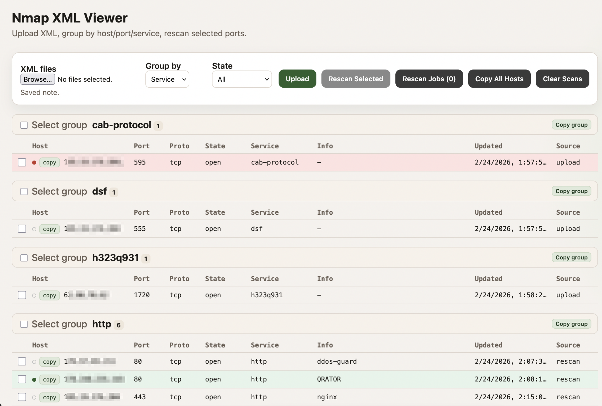

# Nmap XML Viewer
Web UI for viewing Nmap XML results, grouping by host/port/service, rescanning selected ports, and annotating findings.

## Features
1. Upload Nmap XML files and aggregate results.
2. Group by `Service`, `Host`, or `Port`.
3. Filter by `State`.
4. Select rows or whole groups and rescan selected ports.
5. Rescan jobs with live logs, diffs, and notifications (toast).
6. Copy `host:port` for a row, a group, or all results.
7. Delete all records for a host from the details modal.
8. Clear all scans to reload fresh data.
9. Per‑row annotations: color mark + comment (saved in DB).
10. Job history persists in the server JSON DB.

## Requirements
1. Go 1.20+
2. Nmap in `PATH` (only required for `Rescan`)
## Install
```bash
git clone https://github.com/s31frc3/nmap-viewer
cd nmap-viewer
```
## Run
```bash
go run .
```

Optional DB file (JSON):
```bash
go run . -db ./nmap_viewer.db.json
```

If `./nmap_viewer.db.json` exists and `-db` is not provided, the app loads it automatically.

Then open:
```
http://localhost:8080
```
## Usage
1. Upload one or more Nmap XML files.
2. Group and filter as needed.
3. Select rows or groups and click `Rescan Selected`.
4. Use `Rescan Jobs (N)` to open job history and details.
5. Click a row to open details, set a color mark, leave a comment, or delete a host.
6. Use `Copy All Hosts` or per‑row copy to export `host:port`.
## Import Rules
1. TCP import: `open` and `filtered`
2. UDP import: `open` only
## Notes
1. Annotations are stored in the JSON DB.
2. Job history is stored in the JSON DB on the server.
## Flags
1. `-addr` listen address (default `:8080`)
2. `-db` path to JSON database file
